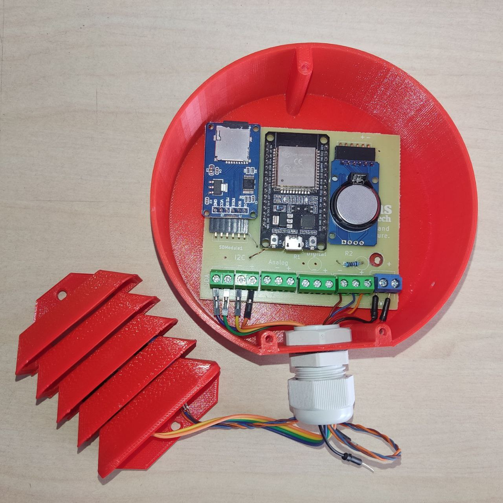

# Maticas datalogger 🚀⭐️

Want to send measurements back to a server through HTTP or MQTT? This is about it along with:

- The PCB design 🤖.
    - The schematic.
    - The PCB layout.
    - Source files for KiCad.
- 3D design 🗿:
    - The enclosure.
    - The sensor holder, stevenson screen.
- Code for the ESP32 💻.
    - Arduino code.

### ESP32 [Bee-Data-Logger](https://github.com/strid3r21/Bee-Data-Logger) Based 🐝

The ESP32 Bee-Data-Logger based solution is a data logger based on the development from [them](https://github.com/strid3r21/Bee-Data-Logger).

It is intended to be final product, we grabbed the schematic pdf they provided and made a PCB design for it, sharing the KiCad files and the Gerber files, so you can make your own PCB, or have an easier time modifying the design.

If you want to find out more about the ESP32 Bee-Data-Logger based solution, check out the [ESP32 Bee-Data-Logger based PCB design doc](/pcb/datalogger-bee-based/).

### ESP32 Dev Board 🔧

The ESP32 Dev Board is a development board with an ESP32 microcontroller. Intended for prototyping and development, but you could use it for a final product. 

If want to find out more about the ESP32 Dev Board, check out the [ESP32 Dev Board code](/src/arduino/datalogger-esp32-dev-board/) and the [ESP32 Dev Board PCB design doc](/pcb/datalogger-esp32-dev-board/).

