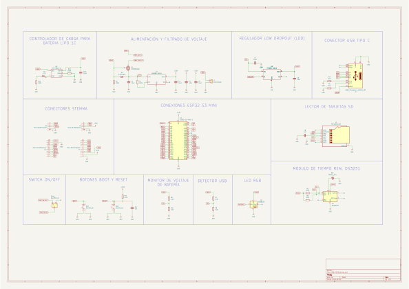
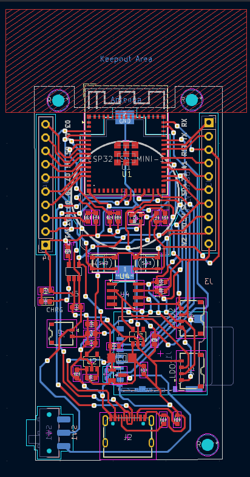
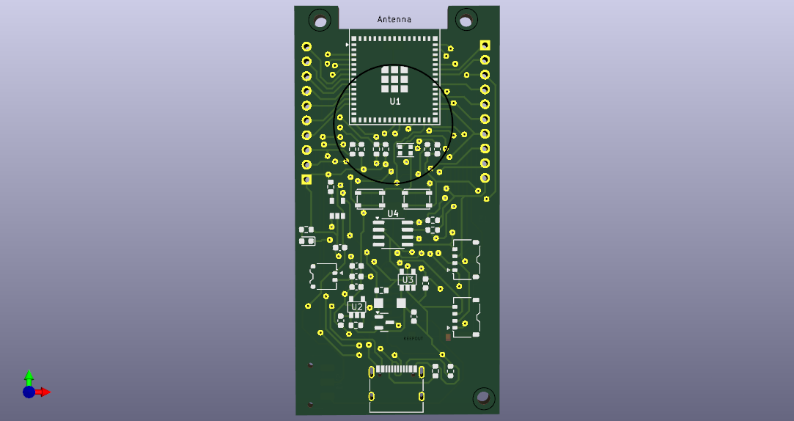
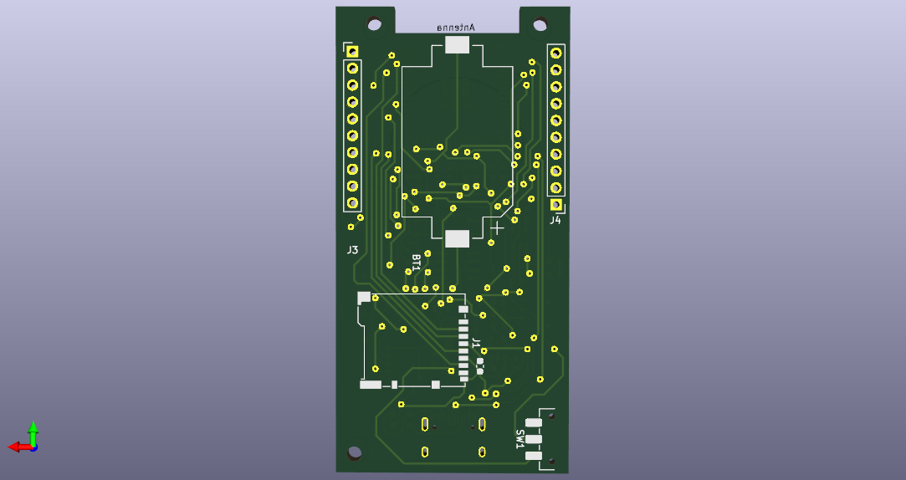

# This file is inspired on the work of the [Bee-Data-Logger](https://github.com/strid3r21/Bee-Data-Logger) project

Basically we took the schematics they shared and a bit of the layout we get from their [youtube video](https://youtu.be/vbtSqaVAqRw?si=KjJlswMw_XBVi3_l) and we made our own version of the datalogger, sharing the source files from kiCad to make it easier for others to replicate the project.

This PCB replica is undergoing testing and will be updated as soon as we have more information.

Huge thanks to the [Bee-Data-Logger](https://github.com/strid3r21/Bee-Data-Logger) project for sharing their work, it was a great inspiration for us, and a huge help to get started with our own datalogger project. Go check their project out! Give them a star️ ⭐️⭐️⭐! 

Please consider that the latest finished PCB version is [PCB_ESP32.kicad_pro](PCB_ESP32.kicad_pro), this is built on top of Kicad 8.0. So far we don't have code along for this project, so if you are interested in replicating this project, you will need to adapt the code from the [Bee-Data-Logger](https://github.com/strid3r21/Bee-Data-Logger)

## Schematics

## PCB Overview

## PCB 3D View

