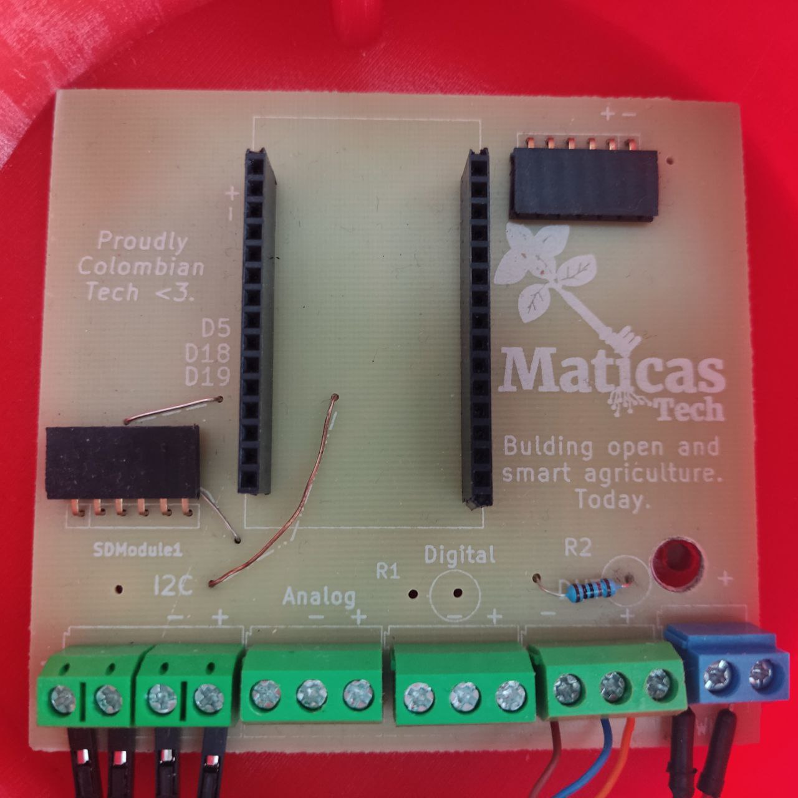
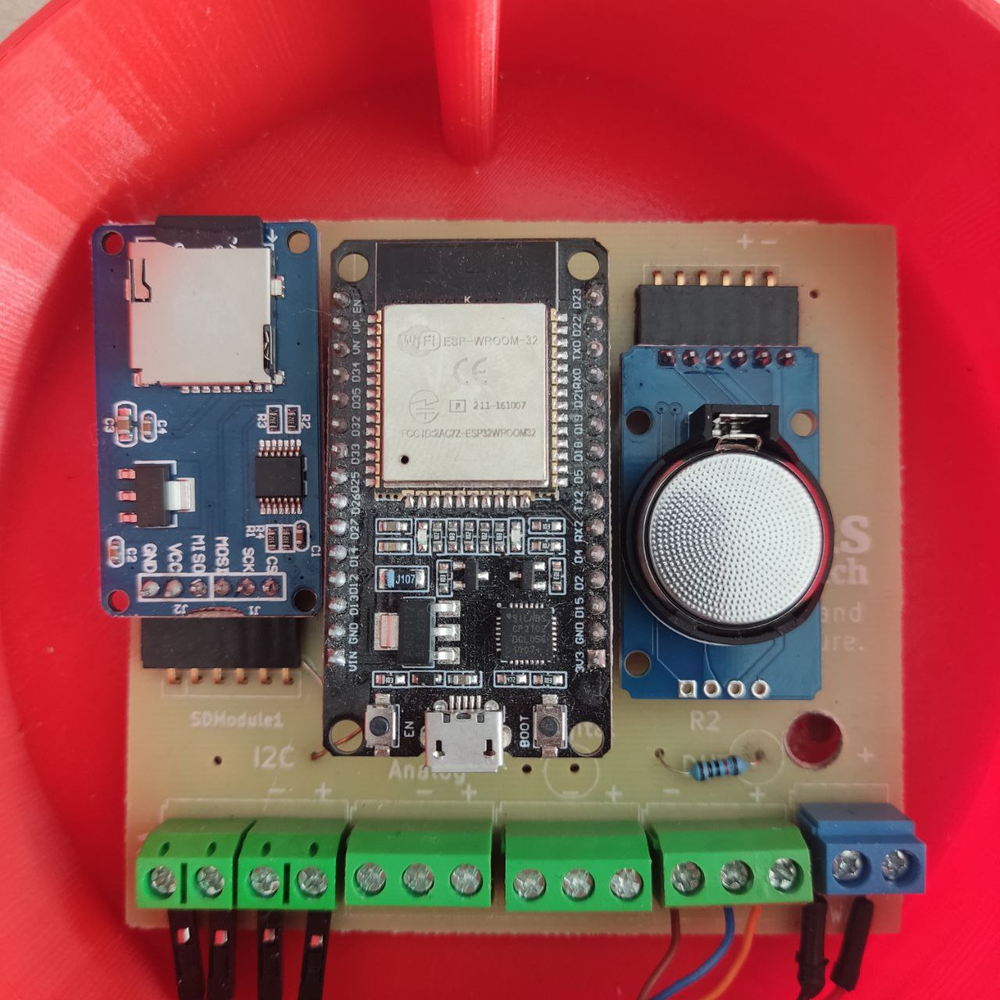
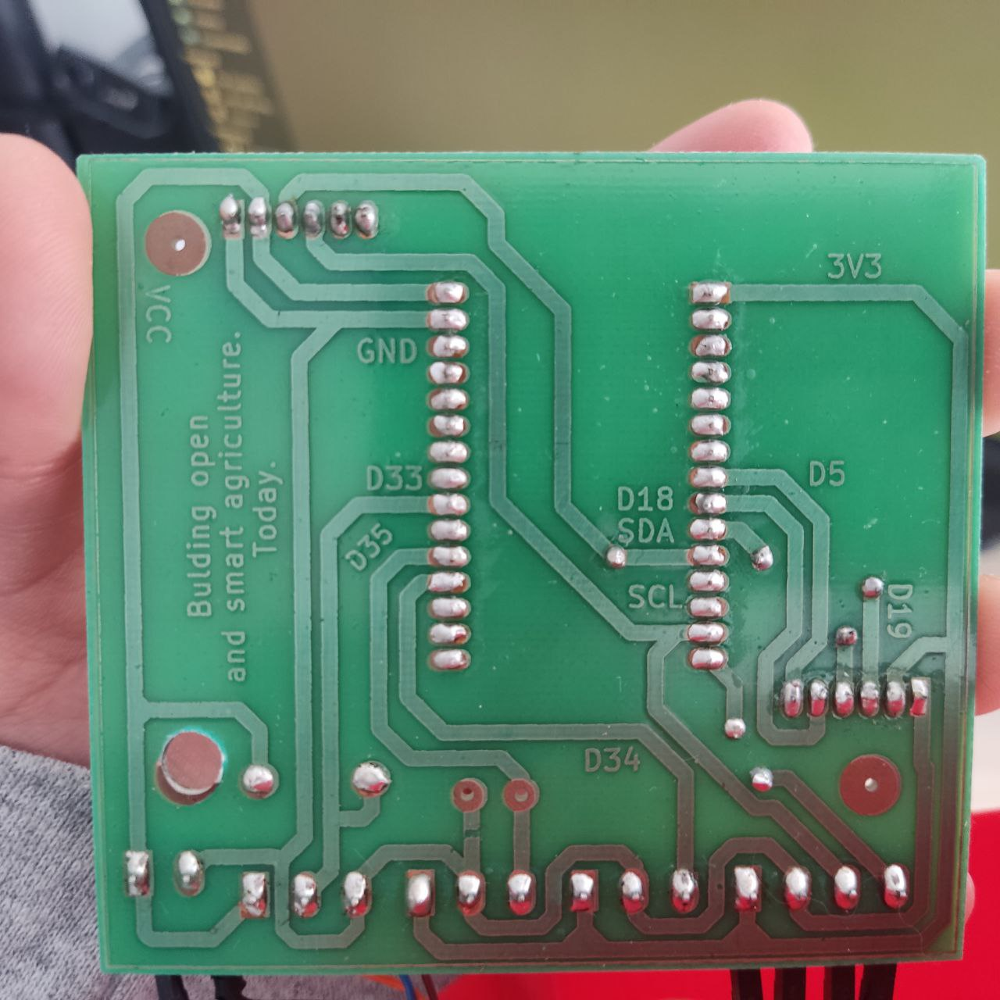
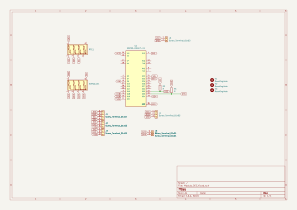
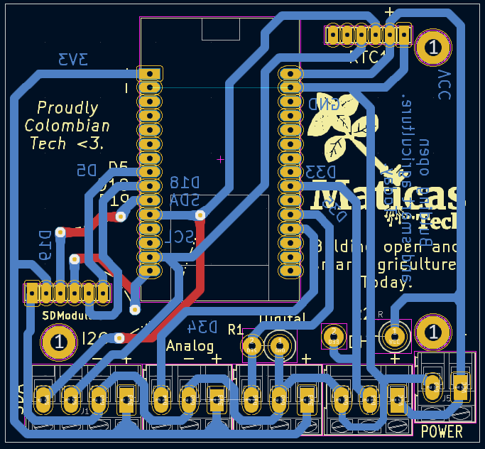
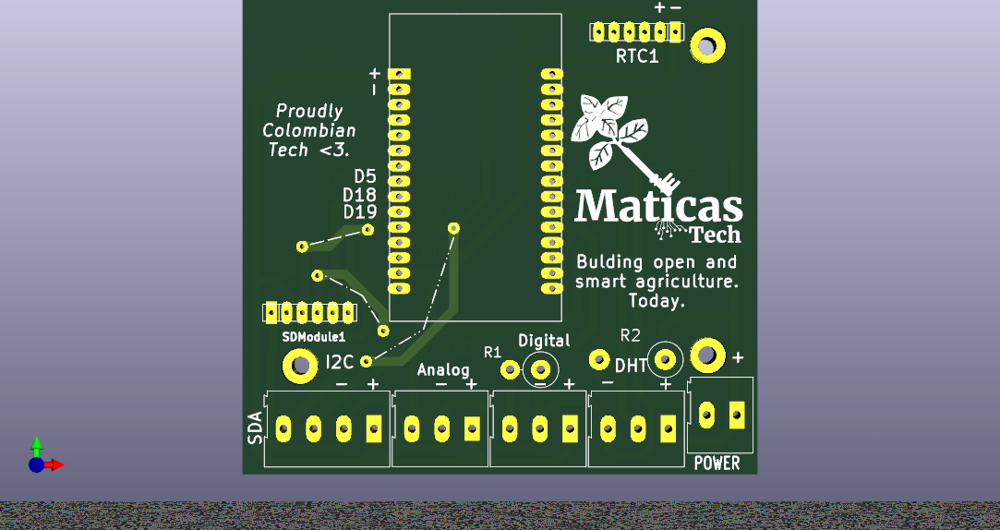
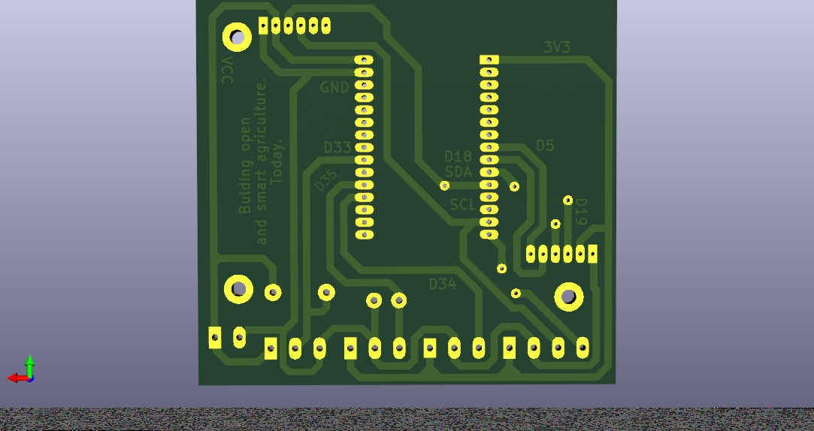

# ESP32 based datalogger development board

This board was designed to be a development board for the ESP32 based datalogger project. It is a simple board with capacity for few sensors and a microSD card slot, along with an RTC. This board is not meant to be a final product, but a development board to help with the development of the datalogger project, does not have a battery management system.

## Features

You can connect:

1. Multiple I2C sensors.
2. 1x Analog sensor.
3. 2x Digital sensor (with pull-up resistor).

And it has:
- MicroSD card slot.
- RTC.

## Product view 

## Schematics

## PCB Overview

## PCB 3D View

